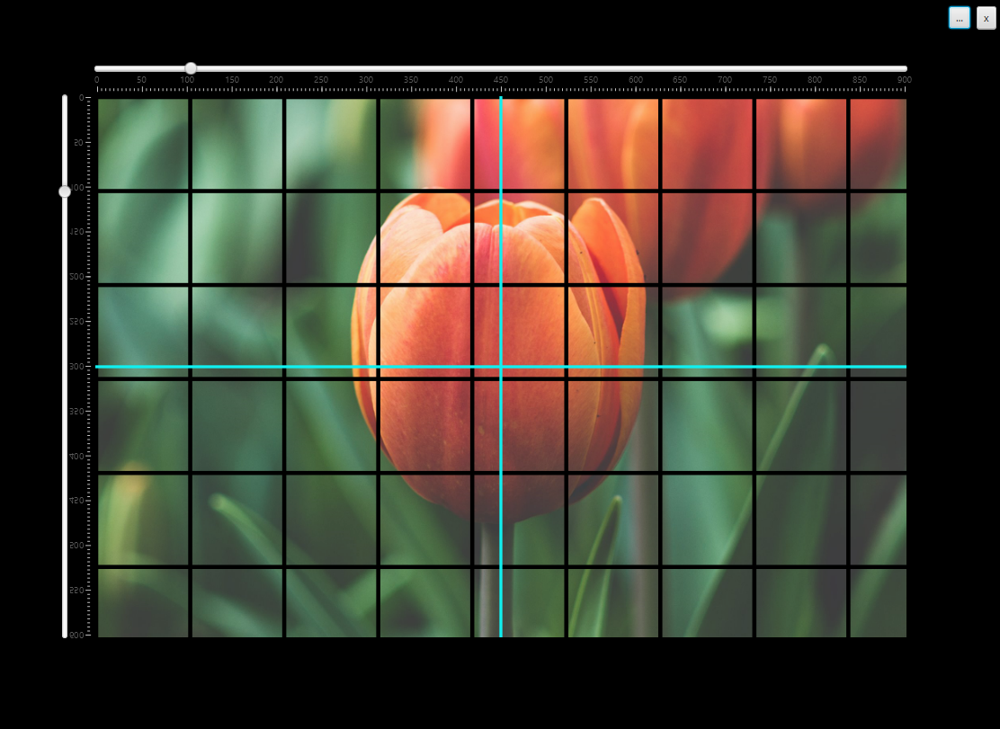

# Dürer grid
> **Dürer grid** is a transparent grid that is placed between the object and the artist. Helps with training the eye to see proportions and angles.

## Getting started 
To get a local copy up and running follow these simple example steps.

### Prerequisites
This section will describe requirements needed to satisfy the installation or running of the project.

 - Java 1.8
 - Maven
 
### Nice to have
 - Intellij

### Build
 - `git clone https://github.com/Tanevski3/durer-grid.git`
 - `cd ./durer-grid`
 - `mvn clean install`
 
### Run
 - Right click and run `MainEntry.java`
 - `target/image/bin/launcher`
 
### Test
 - Run `mvn test`
 
### Deploy
 - `cd gui`
 - `mvn clean compile javafx:jlink`
 - `mv target/durer-grid.zip dist/`

## Usage guide
Use this space to show useful examples of how a project can be used. Additional screenshots, code examples and demos work well in this space. You may also link to more resources.  

## Download
 - The application is now available as a JAR file and Windows executable. Within the `dist/` directory of this repository the executable JAR and Windows exe file (in a zip format) can be found.
 
## Contact

For contact, you can reach me at [marjantanevski@outlook.com](marjantanevski@outlook.com).

## License

MIT © [Marjan Tanevski](marjantanevski@outlook.com)
